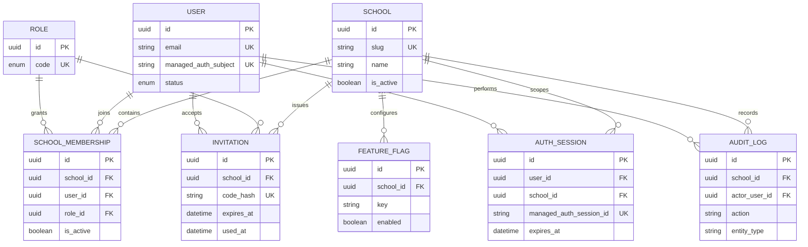

# Database and tenant-isolation rules

## ERD

## Isolation rules

1. `School` is the tenant root. `SchoolMembership`, `Invitation`, `FeatureFlag`, and school-scoped `AuthSession`/`AuditLog` rows carry `school_id`.
2. `User` and `Role` are global identity/catalog records. A user receives school access only through a `SchoolMembership` row.
3. Every tenant repository requires a non-empty `schoolId` and applies it last through `tenantWhere()`. Callers cannot override the tenant boundary by passing another `schoolId` in a filter.
4. Cross-school access must be rejected before a repository call when the requested membership or tenant context does not match the authenticated context. No repository accepts an unscoped tenant-owned lookup.
5. `AuditLog.school_id = NULL` is reserved for platform-wide administrative events; school events must always set it.
6. Membership uniqueness is enforced by `UNIQUE (school_id, user_id)`, not only application code.
7. Invitation values are stored only as SHA-256 hashes. Consumption checks the school, expiry, and unused state, then atomically sets `used_at` with a conditional update. The plaintext code is never persisted.
   The migration also prevents a consumed invitation from being reset to an unused state.
8. The managed-auth mapping stores only an external subject/session identifier. Passwords are not part of this schema.

The migration is in `apps/api/prisma/migrations/20260728000000_initial_multi_tenant_foundation`.
